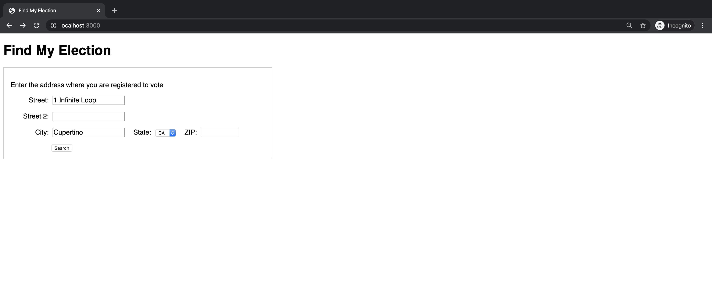
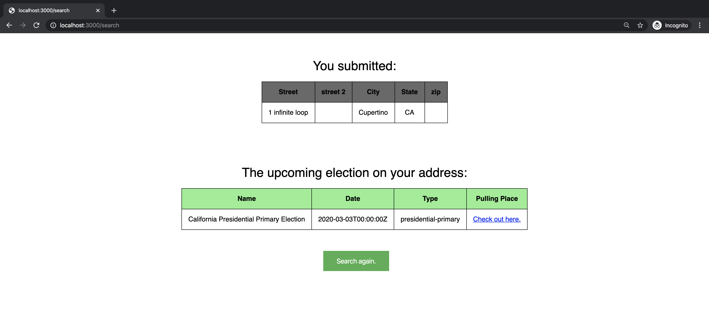
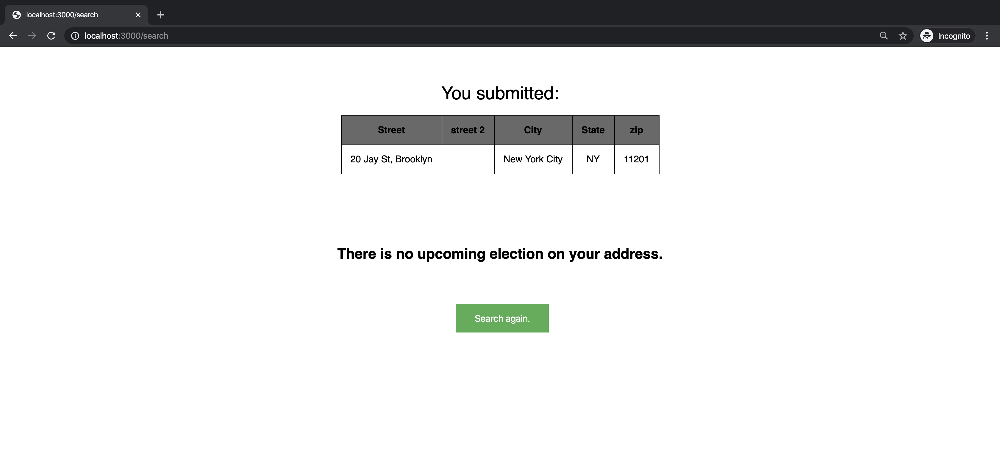

# Upcoming Elections Practical

## Setup

    npm install

## Running

    DEBUG=js-upcoming-elections:* npm start

## Testing

    npm test

## Check out this URL on your browser: [http://localhost:3000/](http://localhost:3000/)

### `Code documentation:`
- New dependency: axios and nodemon.
- After a user input an address and press the `search` button, the application will call the route '/search' with method 'post'.
- I add a new route in `routes/index.js`, with route middleware `upcoming`, which is from `public/controllers/query.js`.
- In `query.js`, `upcoming` handles the inputs and generate the State and place OCD-IDs, then make the API call and get the info back.
- Populate the tables in `views/search.hbs` to display the upcoming election result.
- I also add error class in `utils/errorResponse` to generate errors.
- Other new files: `public/stylesheets/search.css`, `views/no-results.hbs`.

## Result:
- Input an address.

- Get the upcoming election info.

- If there is no upcoming result, show another page.

